# Operations reference

Five MLIR dialects make up the qoala-mlir IR surface. Pick a dialect:

- **[QNet (HIR)](qnet.md)** — value-based quantum semantics, `!qnet.qubit` SSA values, classical send/recv operations referenced by symbol.
- **[QMem (MIR)](qmem.md)** — explicit `i32` qubit-pointer memory model. Side-effecting quantum ops.
- **[QoalaHost (LIR)](qoalahost.md)** — the host-side classical body and block metadata; it calls into NetQASM routines.
- **[NetQASM (LIR)](netqasm.md)** — quantum routines (`local_routine`, `request_routine`) executed on the QPS, using NetQASM's integer-encoded rotation angles.
- **[QRemote (LIR)](qremote.md)** — module-scope symbols for remote nodes referenced by send/recv/eprs ops.

Every page lists ops with their assembly form, operands, results, and notable traits, all extracted from the corresponding `*Ops.td` file under `include/Dialect/`.
